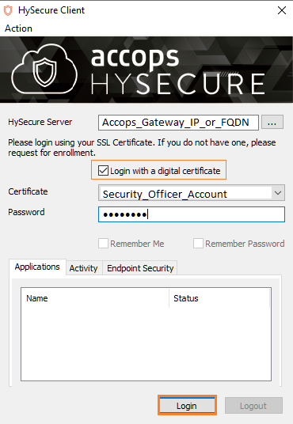
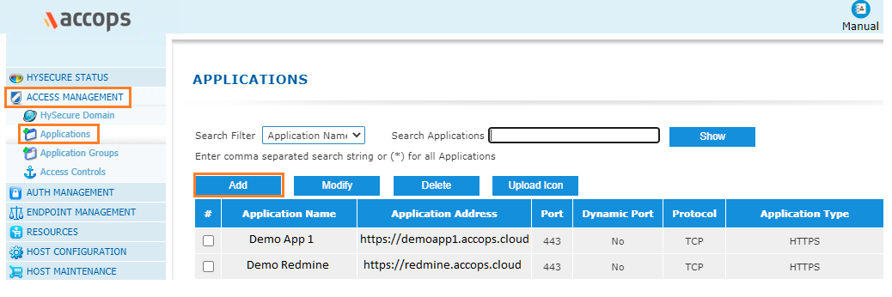
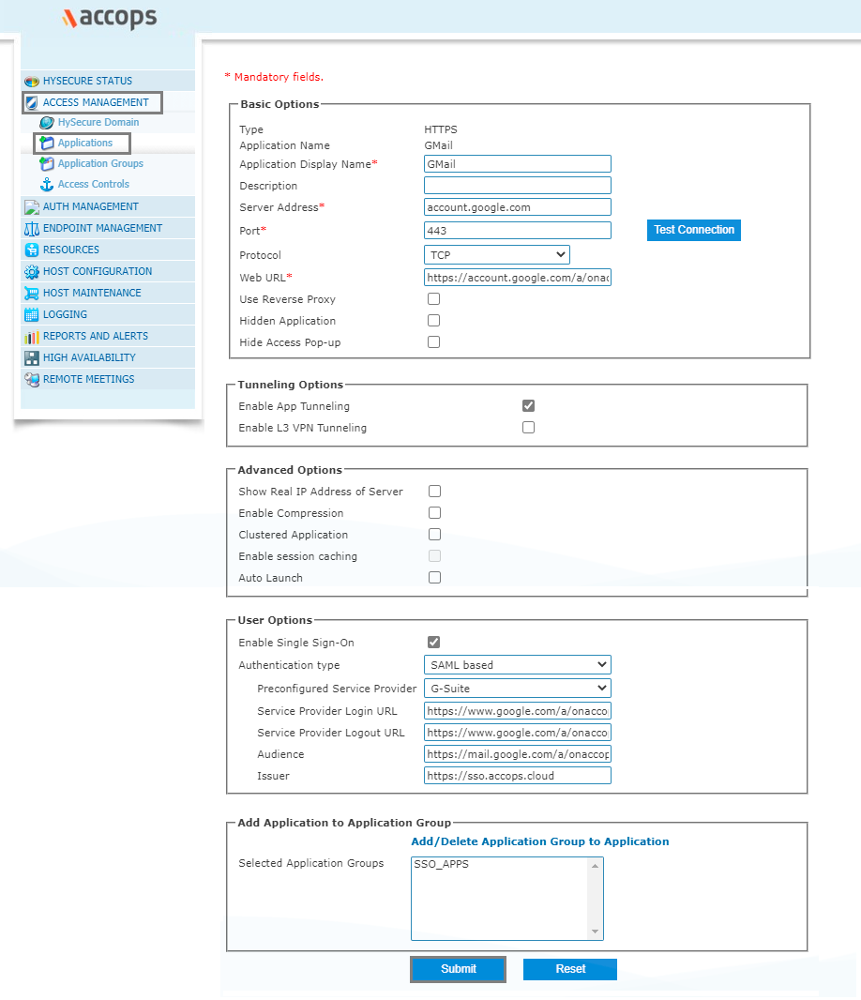
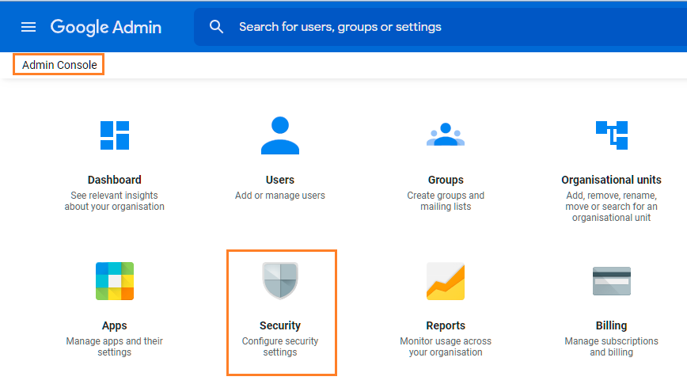
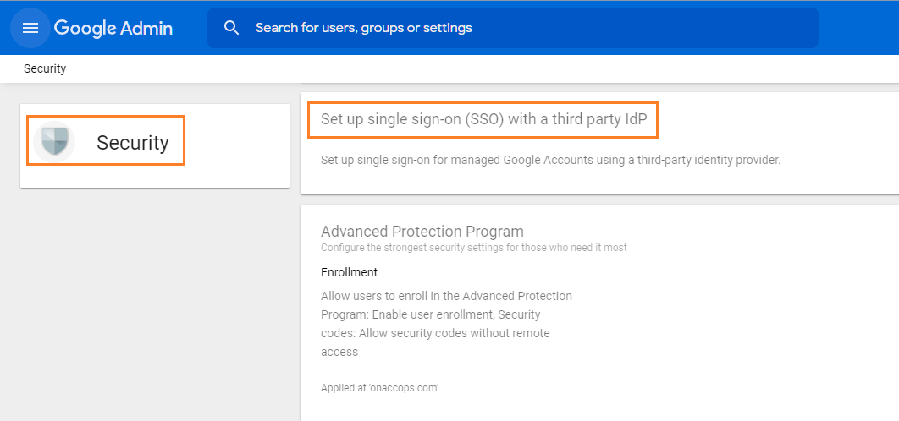
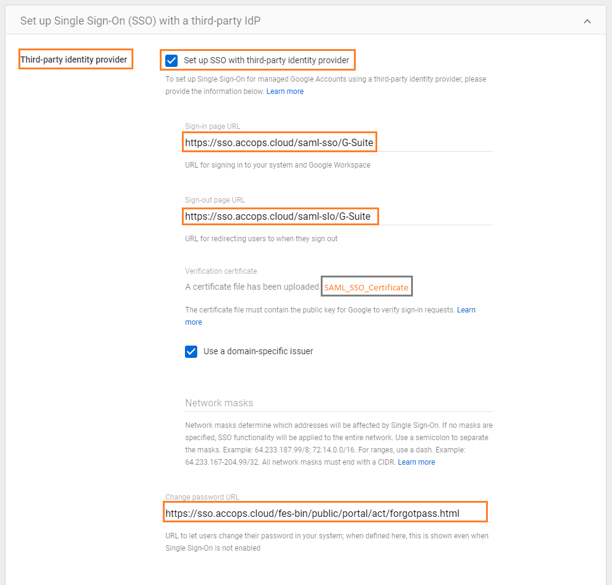
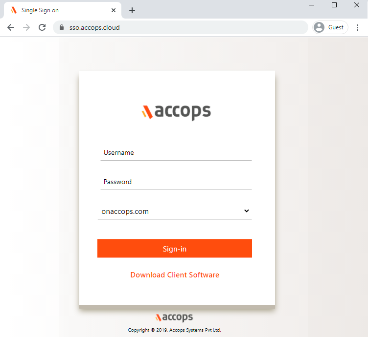
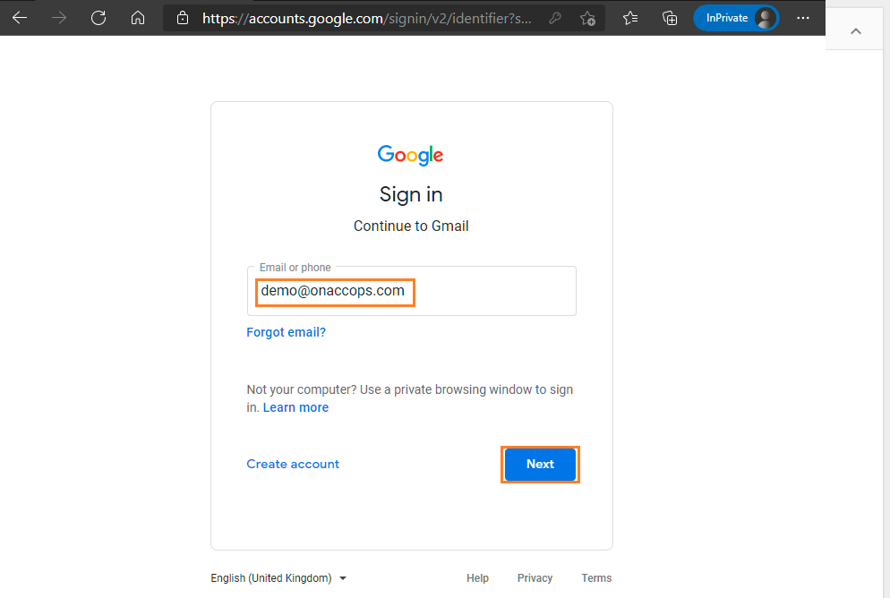
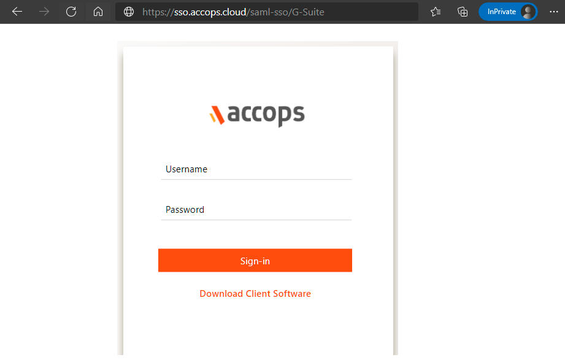
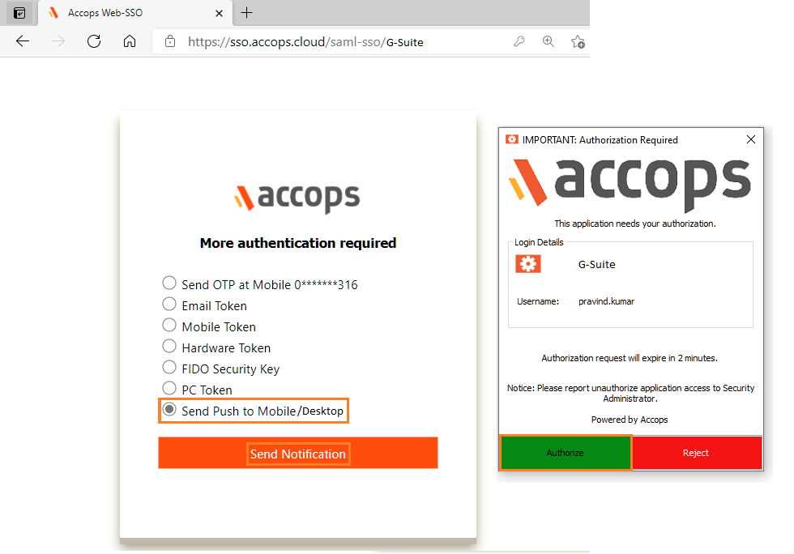

Accops let users to Single Sign-On into Google Workspace account with one set of login credentials, eliminating user-managed passwords and the risk of phishing. Google Workspace Single Sign-On set up leverages the existing on-premise Active Directory infrastructure and provides seamless integration without the need to manage multiple on-premise and cloud identities.

## Environment
* Accops HySecure Gateway v5299, v5360, v6026 onwards
* Gsuite Tenant

## Pre-Requisites
* Gsuite Admin Console Access.
* Accops HySecure Gateway with Public DNS name and valid SSL Certificate.
* Managenent console of HySecure Gateway using Secirity Officer Account.
* Shell Access to Hysecure Gateway.

## Configurations
### Steps to setup G-Suite in Accops (Identity Provider)

**Step 1:** Login with a digital certificate in Accops HySecure Gateway using Security Officer Account.



**Step 2:** Go to "Access Management >> Applications >> Add" .



**Step 3:** Click on Add button to create new application as "Gmail".

|Setting |Value                                          	|
|-----------------------|-----------------------------------|
|**Basic Settings**|										|
|Type					|HTTPS								|	
|Name					|GMail								|
|Description|Gsuite|	
|Application Server Address|account.google.com|
|Application Port|443|
|Protocol|TCP|
|Web URL|https://account.google.com/a/onaccops.com|
|Use Reverse Proxy||
|Hidden Application||
|Hide Access Pop-up||
|**Tunneling Option**||
|Enable App Tunneling| Yes|
|Enable L3 VPN Tunneling||
|**Advanced Options**||
|Show Real IP Address of Server||
|Enable Compression||
|Clustered Application||
|Enable session caching||
|Site to Site Application||	
|Remote Server Name||	
|Auto Launch||
|**User Options**||
|Enable Single Sign-On|Yes|		
|Authentication type|SAML based|
|Preconfigured Service Provider|G-Suite|
|Service Provider Login URL|https://www.google.com/a/onaccops.com/acs|	
|Service Provider Logout URL|https://www.google.com/a/onaccops.com/saml2/sp/slo|	
|Audience|google.com/a/onaccops.com or https://mail.google.com/a/onaccops.com |	
|Issuer|https://sso.accops.cloud|
|**Add Application to Application Group**||	
|Selected Application Groups||

```jsx title="Sample Gmail Configuration"
Type : HTTPS
Name: GMail
Discription: Gsuite
Application Server Address: account.google.com
Application Port: 443
Protocol: TCP
Web URL:  https://account.google.com/a/onaccops.com
Use Reverse Proxy: No
Hidden Application: No
Hide Access Pop-up : No
Enable App Tunnling : Yes
Enable L3 VPN Tunneling : No
Enable Single Sign-on : Yes
Authentication Type : SAML Based
Preconfigured Service Provider : G-Suite
Service Provider Login URL: https://www.google.com/a/onaccops.com/acs
Service Provider Logout URL : https://www.google.com/a/onaccops.com/saml2/sp/slo
Audience : https://mail.google.com/a/onaccops.com
Issuer : https://sso.accops.cloud (HySecure Gateway Address)
```



```jsx title="Adding More SAML SSO Google Apps"

Steps to Adding more Google Apps Like Google Drive, Google Docs, Google Sheets etc.. is same as above.

only SAML Audience need to be updated as per the required Application.

For Example Audience for Google Drive is as below:

Audience : https://drive.google.com/a/onaccops.com

```

**Step 4:** Add google app into New/Existing Application Groups.


** Step 5:** Create/Update an "Application Access"  in New/Exisitng "Access Controls"


** Step 6:** Verify SAML SSO Certificate in Accops HySecure Gateway.

Please ensure below files availability in Accops HySecure Gateway.

```jsx title="Certificate Path: /home/fes/fescommon/certs/"
-rw-r--r-- 1 apache fes    2029 Mar 11 11:08 SAML_Signing_Certificate
-rw------- 1 apache fes    2498 Mar 11 11:09 SAML_Signing_Private_Key
```

:::note

If above files are not present then, Create it using below command
```jsx title="Change the Working Directoty to "/home/fes/fescommon/certs/"

[root@sso1 ~]# cd /home/fes/fescommon/certs/

openssl x509 -inform PEM -in "sslcert.cer" -out SAML_Signing_Certificate

openssl rsa -in "sslcert.pem" -out SAML_Signing_Private_Key
```
:::

** Step 7: ** Copy the content of SAML SSO Certificate *SAML_Signing_Certificate* form Accops Gateway.

:::note

Please ensure while copying the content there aren't any new line in *SAML SSO Certificate*.

```jsx title="cat /home/fes/fescommon/certs/SAML_Signing_Certificate"
-----BEGIN CERTIFICATE-----
MIIFrDCCBJSgAwIBAgISBGJHkNGfVYEtgk7jonYIws6FMA0GCSqGSIb3DQEBCwUA
MDIxCzAJBgNVBAYTAlVTMRYwFAYDVQQKEw1MZXQncyBFbmNyeXB0MQswCQYDVQQD
EwJSMzAeFw0yMTAxMjcxMDA1NDBaFw0yMTA0MjcxMDA1NDBaMBcxFTATBgNVBAMT
DGFjY29wcy5jbG91ZDCCAaIwDQYJKoZIhvcNAQEBBQADggGPADCCAYoCggGBAJYh
aZIcaKxjsQc0pheAN1qDTHUnfRIny3W6dShVEcdHBtVDqLo8BaFZ5elEhRZHt5u9
G1FTtN9r3YN8EyVqGG+VoHFZLs53nT2pKXe+OqtqKtW4sTOEWyVER3lFRRKgL1sx
D8OZwjsDHtPubK9vcTwPE64+nfAcBGj+1tTETgXgsorZXmtybXiexwZxad4tFrFW
XIm0aVB8FwRLiKhNZ5eK6c7+dKwQPkYuS6n60Psg9v/MBzxEE87nHbK5tDMmTotN
xIn8uyi+l7ArPFvIWKIN8O/Qnrym7RH1L73jAuykhwEDXBkNysjpKkTuvthJCeGw
oab9jcbVX5Vx0WCsuwTkvikJbp1NkI9pJcm97ST1d7NOkkIaI9Fq4TgucX2b0ZPr
zCwaIRHXgII9eB9BO7idUi4u+23hB+jZYzGSVBz0lOPs90mW9jaFbPCt8CoX/Pm9
GAq0uFb/ceNrRKtk3gAX9J2/XHqk1rlnCwauT4qo7gfuqW4ygtwkYCSMHPPG+wID
AQABo4ICVTDCAlEwDgYDVR0PAQH/BAQDAgWgMB0GA1UdJQQWMBQGCCsGAQUFBwMB
BggrBgEFBQKDAjAMBgNVHRMBAf8EAjAAMB0GA1UdDgQWBBQ2EBlrVJBjq2oHXam7
Xzv5IVqm/jUfBgNVHSpEGDAWgBQULrMXt1hWy65QCUDmH6+dixTCxjBVBggrBgEF
BQcBAQRJMEMwIQYIKwYBBQUHMAGGFWh0dHA6Ly9yMy5vLmxlbmNyLm9yZzAiBggr
BgEFBQcwAoAWaHR0cDovL3IzLmkubGVuY3Iub3JnLzAnBgNVHREEIDAegg4qLmFj
Y29wcy5jbGR1ZIIMYWNjb3BzLmNsb3VkMEwGA1UdIARFMEMwCAYGZ4EMAQIBMDcG
CysGAQQBgtNTAQEBMCgwJgYIKwYBBQUHAgEWGmh0dHA6Ly9jcHMubGV0c2VuY3J5
cHQub3JnMIOBAgYKKwYBBAHWeQIEAgSB8wSB8ADuAHUAlCC8Ho7VjWyIcx+CiyIs
DdHaTV5sT5W9YdtOL1hNosIAAAF3Q4U54wAABAMARjBEAiBXSdXt8+QVBFC4sy3j
FpJYds7BIMYysomjQXY4EM+AiwIgUOtBJPV6s9mT3VdQOz4+R3CYD08Zu72+bahC
oyT2/+gAdQO2XJQv0XcwIhRUGAgwlFaO400TGTO/3wwvIAvMTvFk4wAAAXdDhTof
AAAEAwBGMEUCIEC8Gb+EDzePNEuEE5pOT0jnV2M41Jj94DTwKEoqjoRxAiAZZUX5
tG4mCC+G4pCRIHhrbxdPoBXj7UsWPzkHiHnZxjANBgkqhkiG9w0BAQsFAAOCAQEA
BV6d943HCsAesV1SiT7+hsBZQsDy7+KcPiSkfq50qMFuD1S2m1PE/Y0tNULT2DxB
fEPGsJrVubND+wJrufAljenEZZzivdrxjAMBBuybqzFlNQoMmIJa7V7xnE9pCSPb
k0UGYKSgHxSsqKxzLiRuneicVyMwyD/LxdF/QbxPfVWnt+mi1rduQk9yhoT6wubq
T99qVOIzPnEkM1MO5qm0mD/xirlO5bbVDqJClGR0ifnrHN5ueWTgbMT1ruCyFcx5
zDPB+7NWzyELdQ82I9UNCZ+/8GNu7bQX6p/w0BzDLwv3i3B5So8QetouPBF4Zpu1
Ejb8AQeQjIMJCWtYHdO4Fg==
-----END CERTIFICATE-----

```
:::

### Steps to setup Accops in G-Suite (Service Provider)

**Step 1:** Go to Google Admin Console https://admin.google.com/u/1/?pli=1 and login with Admin Access.


**Step 2:** Select Security from Google Admin Console.



**Step 3:** Select Set up single sign-on (SSO) with a third party IdP.



**Step 4:** Configure Accops IdP Server Details as below and Click on Save.

```
Sign-in Page URL : https://sso.accops.cloud/saml-sso/G-Suite

Sign-out page URL: https://sso.accops.cloud/saml-slo/G-Suite

Upload IdP SSL Certificate : SAML_SSO_Certificate.cer

Select *Use a domain-specific issuer*
```




## Sign in to your G-Suite

### Using IDP initiated login


* Go to Accops Workspace Portal (https://sso.accops.cloud)

```jsx title="Here you have to enter the sAMAccountName of the user"
For Example: 

Username: pravind.kumar
Password: xxxxxx
Doamin: onaccops.com
```
* Enter Your Login Credentials, Choose domain from dropdown and click on Sign In.

	

* Verify yourself using Multi-Factor Autentcication by choosing the type of MFA from dropdown.

	
	
* Post successful Autentication and Authorization User will will be redirected to Accops Workspace Portal.
	
	
* Click on *G-Suite* icon to launch Single Sign On access to Gmail.  	
	
	
### Using SP initiated login

* Go to to Gmail https://mail.google.com and select Login using *Accops SSO*
  
	

* Autentication request will be redirected to Organization Sign in Page (Accops IDP Login Portal), Enter Authentication details and click on Sign-In.

```jsx title="Here you have to enter the sAMAccountName of the user"
For Example: 

Username: pravind.kumar
Password: xxxxxx
```


* On Below Screen, Accops IDP Server will Prompt More Authenication required, Choose *Send Push to Mobile/Desktop* and Authorize the Desktop Push to Login.

		

* Access G-Suite Portal.
	
	
## Help/Support

Please send a mail to *support@accops.com* for further help/Support.


