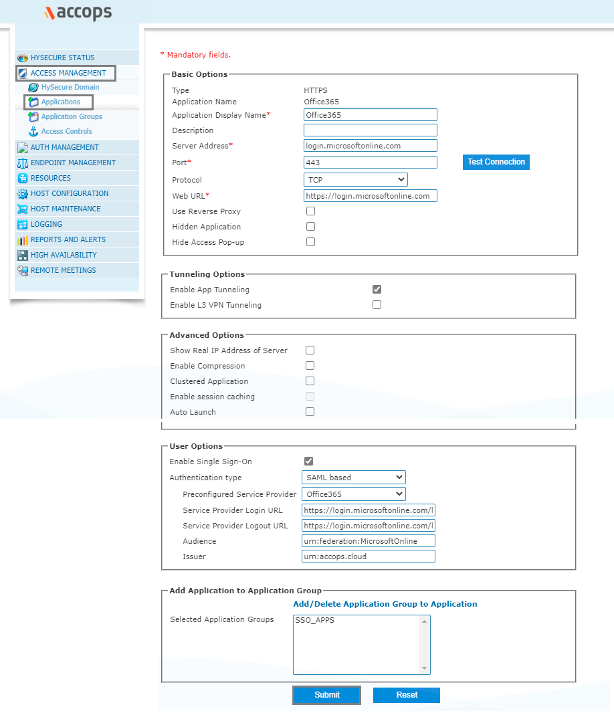
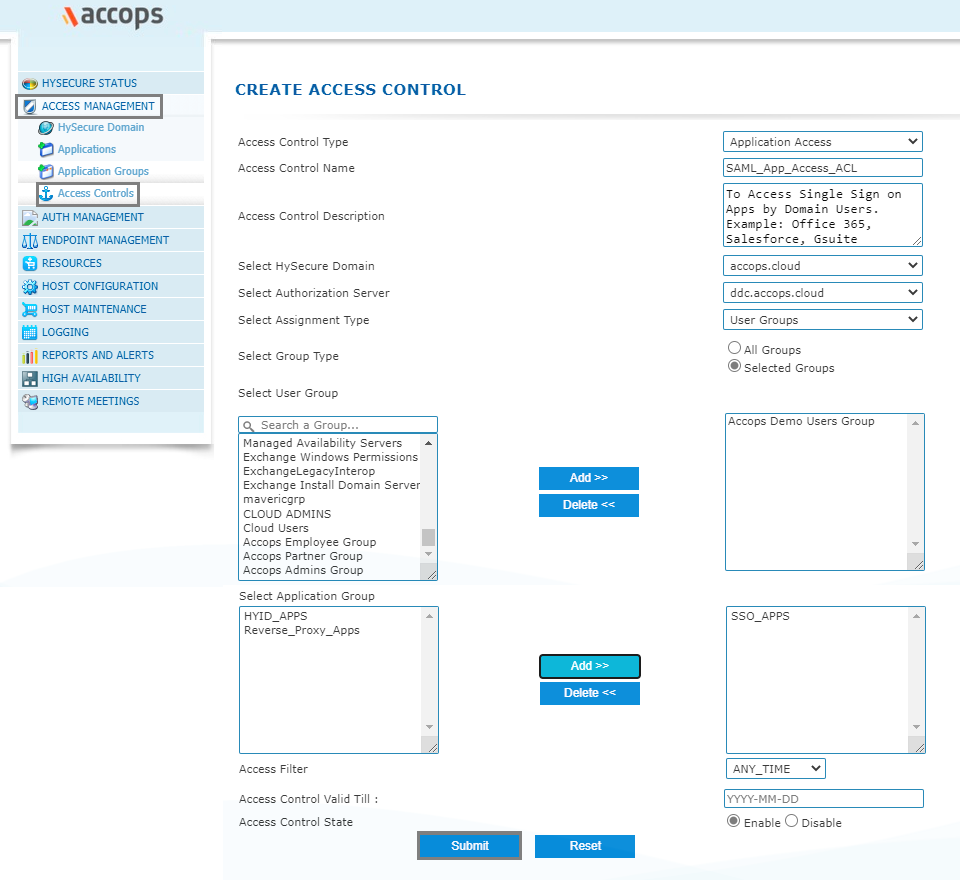
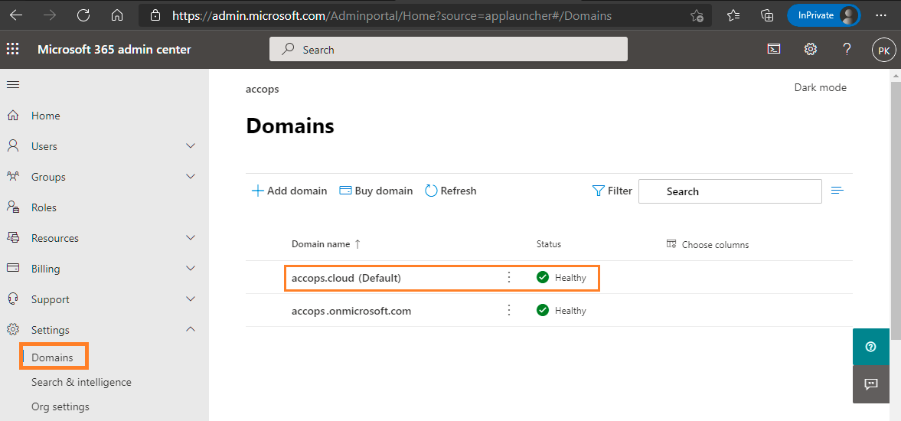
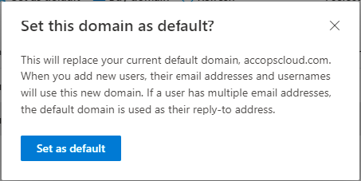
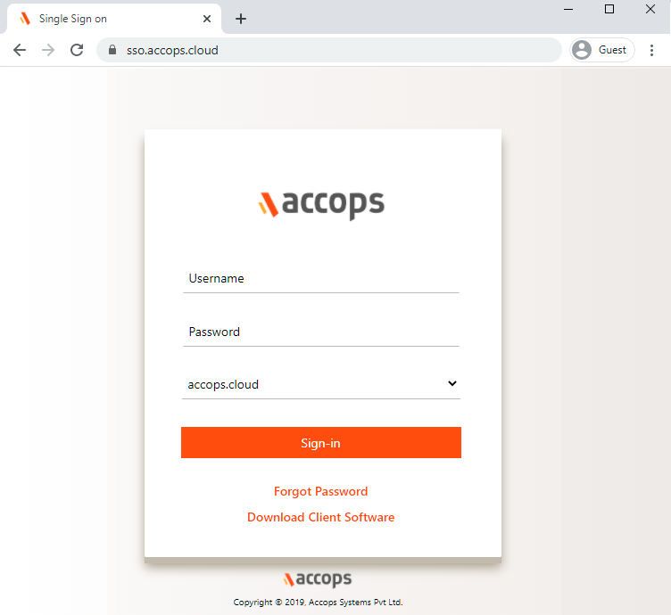

Accops let users to Single Sign-On into Office 365 account with one set of login credentials, eliminating user-managed passwords and the risk of phishing. Office 365 Single Sign-On set up leverages the existing on-premise Active Directory infrastructure and provides seamless integration without the need to manage multiple on-premise and cloud identities.

## Environment
* Accops HySecure Gateway v5299, v5360, v6026 onwards
* Office 365 Tenant

## Pre-Requisites
* Verify your on-premises UPN Domain in Azure AD/Office 365 Tenant.
* Install, Configure & link Office 365 and on-premises Active Directory user accounts using Azure AD connect.
* Sync On-Premise Active Directory with Azure Active Directory.
* Global Admin Access of Office 365 Tenant to Connect using Powerhsell.
* Accops HySecure Gateway with Public DNS name and valid SSL Certificate.
* Managenent console of HySecure Gateway using Secirity Officer Account.
* Shell Access to Hysecure Gateway.

## Configurations
### Steps to setup Office 365 in Accops (Identity Provider)

**Step 1:** Login with a digital certificate in Accops HySecure Gateway using Security Officer Account.


**Step 2:** Go to "Access Management >> Applications" click on  *Add* .


**Step 3:** Create a new application as *Office365*.
```jsx title="Office365"
Type : HTTPS
Name: Office365
Discription: Office365
Application Server Address: login.microsoftonline.com
Application Port: 443
Protocol: TCP
Web URL:  https://login.microsoftonline.com/
Use Reverse Proxy: No
Hidden Application: No
Hide Access Pop-up : No
Enable App Tunnling : Yes
Enable L3 VPN Tunneling : No
Enable Single Sign-on : Yes
Authentication Type : SAML Based
Preconfigured Service Provider : Office365
Service Provider Login URL: https://login.microsoftonline.com/login.srf?sso_reload=true
Service Provider Logout URL : https://login.microsoftonline.com/logout.srf
Audience : urn:federation:MicrosoftOnline
Issuer : https://gateway.accops.cloud (HySecure Gateway Address)
```

**Step 4:** Add Office365 app into New/Existing Application Groups.


** Step 5:** Create/Update an "Application Access"  in New/Exisitng "Access Controls"



** Step 6:** Verify SAML SSO Certificate in Accops HySecure Gateway.

Please ensure below files availability in Accops HySecure Gateway.

```jsx title="Certificate Path: /home/fes/fescommon/certs/"
-rw-r--r-- 1 apache fes    2029 Mar 11 11:08 SAML_Signing_Certificate
-rw------- 1 apache fes    2498 Mar 11 11:09 SAML_Signing_Private_Key
```

:::note

If above files are not present then, create it using below command
```jsx title="Change the Working Directoty to "/home/fes/fescommon/certs/"

[root@sso1 ~]# cd /home/fes/fescommon/certs/

openssl x509 -inform PEM -in "sslcert.cer" -out SAML_Signing_Certificate

openssl rsa -in "sslcert.pem" -out SAML_Signing_Private_Key
```
:::

** Step 7: ** Copy the content of SAML SSO Certificate *SAML_Signing_Certificate* form Accops Gateway.

:::note
This Certificate is required when Federating the Office 365 Domain with Accops Gateway, so please ensure while copying the content there aren't any new line in *SAML SSO Certificate*.

```jsx title="cat /home/fes/fescommon/certs/SAML_Signing_Certificate"
-----BEGIN CERTIFICATE-----
MIIFrDCCBJSgAwIBAgISBGJHkNGfVYEtgk7jonYIws6FMA0GCSqGSIb3DQEBCwUA
MDIxCzAJBgNVBAYTAlVTMRYwFAYDVQQKEw1MZXQncyBFbmNyeXB0MQswCQYDVQQD
EwJSMzAeFw0yMTAxMjcxMDA1NDBaFw0yMTA0MjcxMDA1NDBaMBcxFTATBgNVBAMT
DGFjY29wcy5jbG91ZDCCAaIwDQYJKoZIhvcNAQEBBQADggGPADCCAYoCggGBAJYh
aZIcaKxjsQc0pheAN1qDTHUnfRIny3W6dShVEcdHBtVDqLo8BaFZ5elEhRZHt5u9
G1FTtN9r3YN8EyVqGG+VoHFZLs53nT2pKXe+OqtqKtW4sTOEWyVER3lFRRKgL1sx
D8OZwjsDHtPubK9vcTwPE64+nfAcBGj+1tTETgXgsorZXmtybXiexwZxad4tFrFW
XIm0aVB8FwRLiKhNZ5eK6c7+dKwQPkYuS6n60Psg9v/MBzxEE87nHbK5tDMmTotN
xIn8uyi+l7ArPFvIWKIN8O/Qnrym7RH1L73jAuykhwEDXBkNysjpKkTuvthJCeGw
oab9jcbVX5Vx0WCsuwTkvikJbp1NkI9pJcm97ST1d7NOkkIaI9Fq4TgucX2b0ZPr
zCwaIRHXgII9eB9BO7idUi4u+23hB+jZYzGSVBz0lOPs90mW9jaFbPCt8CoX/Pm9
GAq0uFb/ceNrRKtk3gAX9J2/XHqk1rlnCwauT4qo7gfuqW4ygtwkYCSMHPPG+wID
AQABo4ICVTDCAlEwDgYDVR0PAQH/BAQDAgWgMB0GA1UdJQQWMBQGCCsGAQUFBwMB
BggrBgEFBQKDAjAMBgNVHRMBAf8EAjAAMB0GA1UdDgQWBBQ2EBlrVJBjq2oHXam7
Xzv5IVqm/jUfBgNVHSpEGDAWgBQULrMXt1hWy65QCUDmH6+dixTCxjBVBggrBgEF
BQcBAQRJMEMwIQYIKwYBBQUHMAGGFWh0dHA6Ly9yMy5vLmxlbmNyLm9yZzAiBggr
BgEFBQcwAoAWaHR0cDovL3IzLmkubGVuY3Iub3JnLzAnBgNVHREEIDAegg4qLmFj
Y29wcy5jbGR1ZIIMYWNjb3BzLmNsb3VkMEwGA1UdIARFMEMwCAYGZ4EMAQIBMDcG
CysGAQQBgtNTAQEBMCgwJgYIKwYBBQUHAgEWGmh0dHA6Ly9jcHMubGV0c2VuY3J5
cHQub3JnMIOBAgYKKwYBBAHWeQIEAgSB8wSB8ADuAHUAlCC8Ho7VjWyIcx+CiyIs
DdHaTV5sT5W9YdtOL1hNosIAAAF3Q4U54wAABAMARjBEAiBXSdXt8+QVBFC4sy3j
FpJYds7BIMYysomjQXY4EM+AiwIgUOtBJPV6s9mT3VdQOz4+R3CYD08Zu72+bahC
oyT2/+gAdQO2XJQv0XcwIhRUGAgwlFaO400TGTO/3wwvIAvMTvFk4wAAAXdDhTof
AAAEAwBGMEUCIEC8Gb+EDzePNEuEE5pOT0jnV2M41Jj94DTwKEoqjoRxAiAZZUX5
tG4mCC+G4pCRIHhrbxdPoBXj7UsWPzkHiHnZxjANBgkqhkiG9w0BAQsFAAOCAQEA
BV6d943HCsAesV1SiT7+hsBZQsDy7+KcPiSkfq50qMFuD1S2m1PE/Y0tNULT2DxB
fEPGsJrVubND+wJrufAljenEZZzivdrxjAMBBuybqzFlNQoMmIJa7V7xnE9pCSPb
k0UGYKSgHxSsqKxzLiRuneicVyMwyD/LxdF/QbxPfVWnt+mi1rduQk9yhoT6wubq
T99qVOIzPnEkM1MO5qm0mD/xirlO5bbVDqJClGR0ifnrHN5ueWTgbMT1ruCyFcx5
zDPB+7NWzyELdQ82I9UNCZ+/8GNu7bQX6p/w0BzDLwv3i3B5So8QetouPBF4Zpu1
Ejb8AQeQjIMJCWtYHdO4Fg==
-----END CERTIFICATE-----

```
:::

### Steps to setup Accops in Office 365 (Service Provider)

**Step 1:** Open PowerShell with Admin Rights and Install MSOnline Module.

```jsx title="Install MSOnline Module"
PS C:\Windows\system32> Install-Module MSOnline

NuGet provider is required to continue
PowerShellGet requires NuGet provider version '2.8.5.201' or newer to interact with NuGet-based repositories. The NuGet
provider must be available in 'C:\Program Files\PackageManagement\ProviderAssemblies' or
'C:\Users\Admin\AppData\Local\PackageManagement\ProviderAssemblies'. You can also install the NuGet provider by running
'Install-PackageProvider -Name NuGet -MinimumVersion 2.8.5.201 -Force'. Do you want PowerShellGet to install and import the
NuGet provider now?
[Y] Yes  [N] No  [S] Suspend  [?] Help (default is "Y"): Y

Untrusted repository
You are installing the modules from an untrusted repository. If you trust this repository, change its InstallationPolicy value
by running the Set-PSRepository cmdlet. Are you sure you want to install the modules from 'PSGallery'?
[Y] Yes  [A] Yes to All  [N] No  [L] No to All  [S] Suspend  [?] Help (default is "N"): A

```


**Step 2:** Connect with MsolService using the following command in PowerShell.

```jsx title="Connect Microsoft 365 Online"
PS C:\Windows\system32> Connect-MsolService

```
  * Login to Office 365 Tenant with Global Administrator Account.

      
  * Enter Credentials and click on *Sign In*

      

**Step 3:** Get all Domains.

```jsx title="List All Domain in Office 365 Tenant"

PS C:\Windows\system32> get-MsolDomain

Name                             Status   Authentication
----                             ------   --------------
accops.onmicrosoft.com           Verified Managed
accops.cloud                     Verified Managed
accops.mail.onmicrosoft.com      Verified Managed
```

**Step 4:** Sign in to the Office 365 portal as a Global administrator.

* Office 365 SSO can be enabled only for domains that are verified in Azure AD.
* Office 365 SSO cannot be enabled for "onmicrosoft.com" domains that are created by Microsoft.
* Office 365  SSO cannot be enabled for the default domain (the primary domain in which users are created). It can only be configured for custom domains. 
* Office 365 prohibits SSO configuration for default domains to ensure that administrators can log in to Office 365 regardless of issues with the IdP. 

* If your organization does not have a custom Office 365 domain, you need to purchase one in order to configure SSO.
Federated domains, i.e., domains in which SSO has been enabled, cannot be configured for password synchronization.


To update Default Domain in Office 365 Tenant, Go to https://admin.microsoft.com/Adminportal/Home?source=applauncher#/Domains

**Before**



**Select *accops.onmicrosoft.com* and Mark it as Default Domain.**


**Accept confirmation prompt**



**After**


**Step 5:** To configure *accops.cloud* as federated domain, below are the pre-requsites.

```jsx title="Before using this update the required parameter as per your settings"
$dom="accops.cloud" 								     <Please replace it with Your Domain>
$brand="ACCOPS"       						             <Please replace it with Your Brand Name>
$LogOnUrl="https://sso.accops.cloud/saml-sso/Office365"  <Please replace *sso.accops.cloud* with Your Accops HySecure Gateway FQDN Address>
$MetadataUri="https://login.microsoftonline.com/"        <No Change>
$MySigningCert="SAML SSO Certificate"                    <Please replace SAML SSO Certificate>
$uri="urn:accops.cloud"                                  <Please replace *accops.cloud* with your Federated Domain name>
$LogOffUrl="https://sso.accops.cloud/saml-slo/Office365" <Please replace *sso.accops.cloud* with Your Accops HySecure Gateway FQDN Address>

```

```jsx title="Sample contains with Required Parameters"
$dom="accops.cloud"
$brand="ACCOPS" 
$LogOnUrl="https://sso.accops.cloud/saml-sso/Office365"
$MetadataUri="https://login.microsoftonline.com/"
$MySigningCert="MIIFrDCCBJSgAwIBAgISBGJHkNGfVYEtgk7jonYIws6FMA0GCSqGSIb3DQEBCwUA
MDIxCzAJBgNVBAYTAlVTMRYwFAYDVQQKEw1MZXQncyBFbmNyeXB0MQswCQYDVQQD
EwJSMzAeFw0yMTAxMjcxMDA1NDBaFw0yMTA0MjcxMDA1NDBaMBcxFTATBgNVBAMT
DGFjY29wcy5jbG91ZDCCAaIwDQYJKoZIhvcNAQEBBQADggGPADCCAYoCggGBAJYh
aZIcaKxjsQc0pheAN1qDTHUnfRIny3W6dShVEcdHBtVDqLo8BaFZ5elEhRZHt5u9
G1FTtN9r3YN8EyVqGG+VoHFZLs53nT2pKXe+OqtqKtW4sTOEWyVER3lFRRKgL1sx
D8OZwjsDHtPubK9vcTwPE64+nfAcBGj+1tTETgXgsorZXmtybXiexwZxad4tFrFW
XIm0aVB8FwRLiKhNZ5eK6c7+dKwQPkYuS6n60Psg9v/MBzxEE87nHbK5tDMmTotN
xIn8uyi+l7ArPFvIWKIN8O/Qnrym7RH1L73jAuykhwEDXBkNysjpKkTuvthJCeGw
oab9jcbVX5Vx0WCsuwTkvikJbp1NkI9pJcm97ST1d7NOkkIaI9Fq4TgucX2b0ZPr
zCwaIRHXgII9eB9BO7idUi4u+23hB+jZYzGSVBz0lOPs90mW9jaFbPCt8CoX/Pm9
GAq0uFb/ceNrRKtk3gAX9J2/XHqk1rlnCwauT4qo7gfuqW4ygtwkYCSMHPPG+wID
AQABo4ICVTDCAlEwDgYDVR0PAQH/BAQDAgWgMB0GA1UdJQQWMBQGCCsGAQUFBwMB
BggrBgEFBQKDAjAMBgNVHRMBAf8EAjAAMB0GA1UdDgQWBBQ2EBlrVJBjq2oHXam7
Xzv5IVqm/jUfBgNVHSpEGDAWgBQULrMXt1hWy65QCUDmH6+dixTCxjBVBggrBgEF
BQcBAQRJMEMwIQYIKwYBBQUHMAGGFWh0dHA6Ly9yMy5vLmxlbmNyLm9yZzAiBggr
BgEFBQcwAoAWaHR0cDovL3IzLmkubGVuY3Iub3JnLzAnBgNVHREEIDAegg4qLmFj
Y29wcy5jbGR1ZIIMYWNjb3BzLmNsb3VkMEwGA1UdIARFMEMwCAYGZ4EMAQIBMDcG
CysGAQQBgtNTAQEBMCgwJgYIKwYBBQUHAgEWGmh0dHA6Ly9jcHMubGV0c2VuY3J5
cHQub3JnMIOBAgYKKwYBBAHWeQIEAgSB8wSB8ADuAHUAlCC8Ho7VjWyIcx+CiyIs
DdHaTV5sT5W9YdtOL1hNosIAAAF3Q4U54wAABAMARjBEAiBXSdXt8+QVBFC4sy3j
FpJYds7BIMYysomjQXY4EM+AiwIgUOtBJPV6s9mT3VdQOz4+R3CYD08Zu72+bahC
oyT2/+gAdQO2XJQv0XcwIhRUGAgwlFaO400TGTO/3wwvIAvMTvFk4wAAAXdDhTof
AAAEAwBGMEUCIEC8Gb+EDzePNEuEE5pOT0jnV2M41Jj94DTwKEoqjoRxAiAZZUX5
tG4mCC+G4pCRIHhrbxdPoBXj7UsWPzkHiHnZxjANBgkqhkiG9w0BAQsFAAOCAQEA
BV6d943HCsAesV1SiT7+hsBZQsDy7+KcPiSkfq50qMFuD1S2m1PE/Y0tNULT2DxB
fEPGsJrVubND+wJrufAljenEZZzivdrxjAMBBuybqzFlNQoMmIJa7V7xnE9pCSPb
k0UGYKSgHxSsqKxzLiRuneicVyMwyD/LxdF/QbxPfVWnt+mi1rduQk9yhoT6wubq
T99qVOIzPnEkM1MO5qm0mD/xirlO5bbVDqJClGR0ifnrHN5ueWTgbMT1ruCyFcx5
zDPB+7NWzyELdQ82I9UNCZ+/8GNu7bQX6p/w0BzDLwv3i3B5So8QetouPBF4Zpu1
Ejb8AQeQjIMJCWtYHdO4Fg=="
$uri="urn:accops.cloud"
$LogOffUrl="https://sso.accops.cloud/saml-slo/Office365"
```
**Step 6:** Run the below command in PowerShell to enable SSO in Office 365.
```
PS C:\Windows\system32> Set-MsolDomainAuthentication -DomainName $dom -FederationBrandName $brand -Authentication Federated -ActiveLogOnUri $LogOnUrl -PassiveLogOnUri $LogOnUrl -MetadataExchangeUri $MetadataUri -SigningCertificate $MySigningCert -IssuerUri $uri -LogOffUri $LogOffUrl -PreferredAuthenticationProtocol SAMLP

```
**Step 7:** Verify Domain Status.

```jsx title="Federated Domain"
PS C:\Windows\system32> Get-MsolDomain

Name                             Status   Authentication
----                             ------   --------------
accops.onmicrosoft.com           Verified Managed
accops.cloud                     Verified Federated
accops.mail.onmicrosoft.com 	 Verified Managed
```
* Veryfy Federation configuration, use the following command.

```jsx title="Federation Settings"
PS C:\Windows\system32> Get-MSolDomainFederationSettings -DomainName "accops.cloud" | Format-List *


ExtensionData                          : System.Runtime.Serialization.ExtensionDataObject
ActiveLogOnUri                         : https://sso.accops.cloud/saml-sso/Office365
DefaultInteractiveAuthenticationMethod :
FederationBrandName                    : ACCOPS
IssuerUri                              : urn:accops.cloud
LogOffUri                              : https://sso.accops.cloud/saml-slo/Office365
MetadataExchangeUri                    : https://login.microsoftonline.com/
NextSigningCertificate                 :
OpenIdConnectDiscoveryEndpoint         :
PassiveLogOnUri                        : https://sso.accops.cloud/saml-sso/Office365
PasswordChangeUri                      :
PasswordResetUri                       :
PreferredAuthenticationProtocol        : Samlp
PromptLoginBehavior                    :
SigningCertificate                     : MIIFrDCCBJSgAwIBAgISBGJHkNGfVYEtgk7jonYIws6FMA0GCSqGSIb3DQEBCwUA
                                         MDIxCzAJBgNVBAYTAlVTMRYwFAYDVQQKEw1MZXQncyBFbmNyeXB0MQswCQYDVQQD
                                         EwJSMzAeFw0yMTAxMjcxMDA1NDBaFw0yMTA0MjcxMDA1NDBaMBcxFTATBgNVBAMT
                                         DGFjY29wcy5jbG91ZDCCAaIwDQYJKoZIhvcNAQEBBQADggGPADCCAYoCggGBAJYh
                                         aZIcaKxjsQc0pheAN1qDTHUnfRIny3W6dShVEcdHBtVDqLo8BaFZ5elEhRZHt5u9
                                         G1FTtN9r3YN8EyVqGG+VoHFZLs53nT2pKXe+OqtqKtW4sTOEWyVER3lFRRKgL1sx
                                         D8OZwjsDHtVubK9vcTwPE64+nfAcBGj+1tTETgXgsorZXmtybXiexwZxad4tFrFW
                                         XIm0aVB8FwLRiKhNZ5eK6c7+dKwQPkYuS6n60Psg9v/MBzxEE87nHbK5tDMmTotN
                                         xIn8uyi+l7OrPFvIWKIN8O/Qnrym7RH1L73jAuykhwEDXBkNysjpKkTuvthJCeGw
                                         oab9jcbVX5Kx0WCsuwTkvikJbp1NkI9pJcm97ST1d7NOkkIaI9Fq4TgucX2b0ZPr
                                         zCwaIRHXgIS9PB9BO7idUi4u+23hB+jZYzGSVBz0lOPs90mW9jaFbPCt8CoX/Pm9
                                         GAq0uFb/ceqrRKtk3gAX9J2/XHqk1rlnCwauT4qo7gfuqW4ygtwkYCSMHPPG+wID
                                         AQABo4ICVTCCAlEwDgYDVR0PAQH/BAQDAgWgMB0GA1UdJQQWMBQGCCsGAQUFBwMB
                                         BggrBgEFBQcDVjAMBgNVHRMBAf8EAjAAMB0GA1UdDgQWBBQ2EBlrVJBjq2oHXam7
                                         Xzv5IVqm/jAfIgNVHSMEGDAWgBQULrMXt1hWy65QCUDmH6+dixTCxjBVBggrBgEF
                                         BQcBAQRJMEcwNQYIKwYBBQUHMAGGFWh0dHA6Ly9yMy5vLmxlbmNyLm9yZzAiBggr
                                         BgEFBQcwAoYWDHR0cDovL3IzLmkubGVuY3Iub3JnLzAnBgNVHREEIDAegg4qLmFj
                                         Y29wcy5jbG91KIIMYWNjb3BzLmNsb3VkMEwGA1UdIARFMEMwCAYGZ4EMAQIBMDcG
                                         CysGAQQBgt8TUQEBMCgwJgYIKwYBBQUHAgEWGmh0dHA6Ly9jcHMubGV0c2VuY3J5
                                         cHQub3JnMIIBMgYKKwYBBAHWeQIEAgSB8wSB8ADuAHUAlCC8Ho7VjWyIcx+CiyIs
                                         DdHaTV5sT5Q9AdtOL1hNosIAAAF3Q4U54wAABAMARjBEAiBXSdXt8+QVBFC4sy3j
                                         FpJYds7BIM6yRomjQXY4EM+AiwIgUOtBJPV6s9mT3VdQOz4+R3CYD08Zu72+bahC
                                         oyT2/+gAdQD2XJQv0XcwIhRUGAgwlFaO400TGTO/3wwvIAvMTvFk4wAAAXdDhTof
                                         AAAEAwBGMEQCIEC8Gb+EDzePNEuEE5ZOT0jnV2M41Jj94DTwKEoqjoRxAiAZZUX5
                                         tG4mCC+G4pkRIHhrbxdPoBXj7UsWPzkHiHnZxjANBgkqhkiG9w0BAQsFAAOCAQEA
                                         BV6d943HCsgesV1SiT7+hsBZQsDy7+KcPiSkfq50qMFuD1S2m1PE/Y0tNULT2DxB
                                         fEPGsJrVubSD+wJrufAljenEZZzivdrxjAMBBuybqzFlNQoMmIJa7V7xnE9pCSPb
                                         k0UGYKSgHxXsqKxzLiRuneicVyMwyD/LxdF/QbxPfVWnt+mi1rduQk9yhoT6wubq
                                         T99qVOIzPnnkM1MO5qm0mD/xirlO5bbVDqJClGR0ifnrHN5ueWTgbMT1ruCyFcx5
                                         zDPB+7NWzyKLdQ82I9UNCZ+/8GNu7bQX6p/w0BzDLwv3i3B5So8QetouPBF4Zpu1
                                         Ejb8AQeQjI8JCWtYHdO4Fg==
SigningCertificateUpdateStatus         :
SupportsMfa                            :
```
**Step 8:** Reconfigure or update SSO settings.

:::caution

If you are already using SSO for Office 365 from another identity provider or want to update Accops as a Identity Provider for SSO settings, then you must first disable SSO in Office 365, and then follow the steps in this guide from Step 5 to Step 7. 

:::
```jsx title="To Disable SSO in Office 365, use the command given below"
$dom = "accops.cloud"      <Please replace it with Your Domain>
Set-MsolDomainAuthentication -DomainName $dom -Authentication Managed

```
## Sign in to your Office 365

### Using IDP initiated login


* Go to Accops Workspace Portal (https://sso.accops.cloud)

```jsx title="Here you have to enter the sAMAccountName of the user"
For Example: 

Username: pravind.kumar
Password: xxxxxx
Doamin: accops.cloud
```
* Enter Login Credentials, Choose domain from dropdown and click on Sign In.

	

* Verify yourself using Multi-Factor Autentcication by choosing the type of MFA from dropdown.
	
	
* Post Successful Autentication and Authorization User will will be redirected to Accops Workspace Portal.
	
	
* click on *Office365* icon to launch Single Sign On access to Office 365.  	
	
	
### Using SP initiated login

* Go to Office 365 portal https://office.com and Sign In with Email Address.
  
		

* Autentication request will be Reqdirected to Organization Sign in Page (Accops IDP Login Portal)

	
	
* Enter Authentication details and click on Sign-In

```jsx title="Here you have to enter the sAMAccountName of the user"
For Example: 

Username: pravind.kumar
Password: xxxxxx
```


* On Below Screen, Accops IDP Server will Prompt More AUthenication required, Choose MFA type and click on Sign In.

		

* Select Stay Signed in?

	

* Access Office 365 Portal.
	
	
## Help/Support

Please send a mail to *support@accops.com* for further help/Support.

