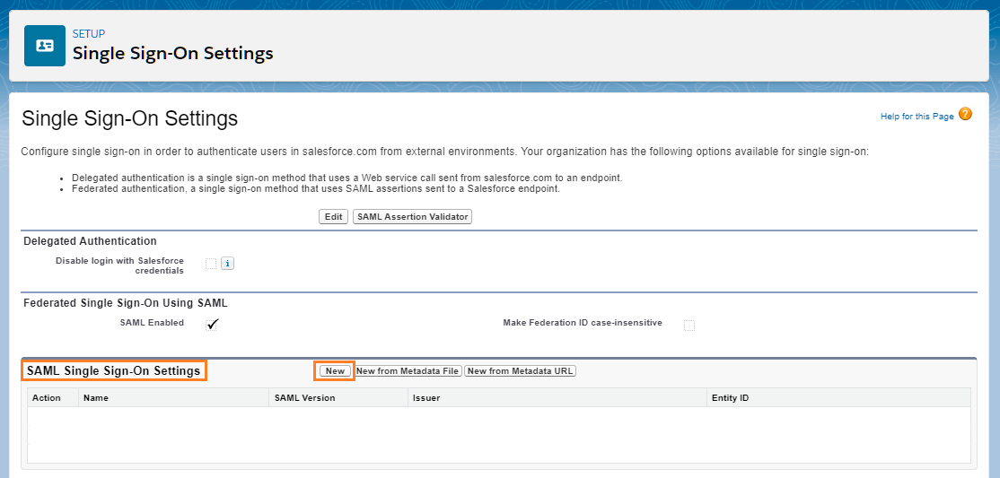
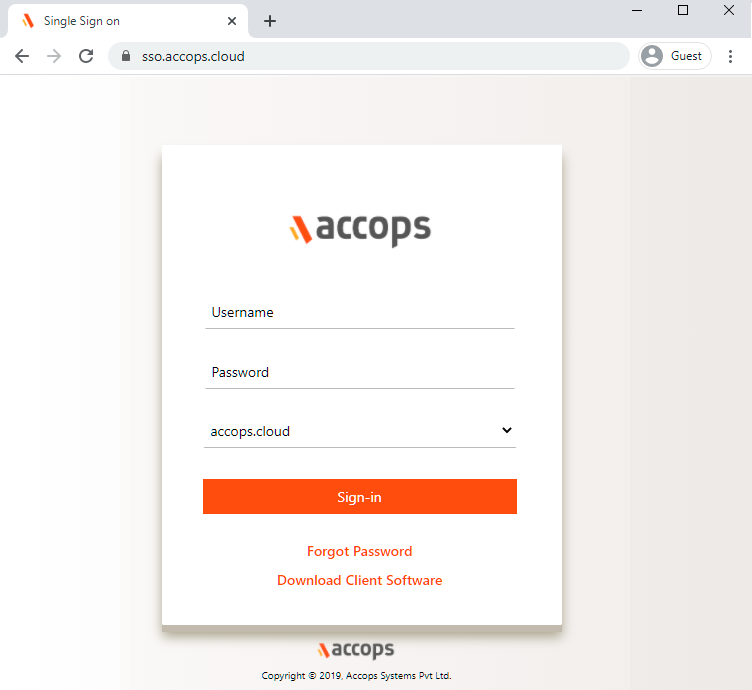

Accops let users to Single Sign-On into Salesforce account with one set of login credentials, eliminating user-managed passwords and the risk of phishing. Salesforce Single Sign-On set up leverages the existing on-premise Active Directory infrastructure and provides seamless integration without the need to manage multiple on-premise and cloud identities.

## Environment
* Accops HySecure Gateway v5299, v5360, v6026 onwards
* Salseforce Tenant

## Pre-Requisites
* Salesforce Admin Portal Access.
* Accops HySecure Gateway with Public DNS name and valid SSL Certificate.
* Managenent console of HySecure Gateway using Secirity Officer Account.
* Shell Access to Hysecure Gateway.

## Configurations
### Steps to setup Salesforce in Accops (Identity Provider)

**Step 1:** Login with a digital certificate in Accops HySecure Gateway using Security Officer Account.


**Step 2:** Go to "Access Management >> Applications >> Add" .


**Step 3:** Click on Add button to create new application as "Salesforce".
:::note
Go to Salesforce Portal https://login.salesforce.com/ and login with your GLobal Admin and get the info of Salesforce Tenant.
:::
```jsx title="Salesforce"
Type : HTTPS
Name: Salesforce
Discription: Salesforce
Application Server Address: accops-dev-ed.lightning.force.com
Application Port: 443
Protocol: TCP
Web URL:  https://accops-dev-ed.lightning.force.com/lightning/setup/SetupOneHome/home
Use Reverse Proxy: No
Hidden Application: No
Hide Access Pop-up : No
Enable App Tunnling : Yes
Enable L3 VPN Tunneling : No
Enable Single Sign-on : Yes
Authentication Type : SAML Based
Preconfigured Service Provider : Salesforce
Service Provider Login URL: https://accops-dev-ed.my.salesforce.com
Service Provider Logout URL : https://accops-dev-ed.my.salesforce.com/services/auth/sp/saml2/logout
Audience : https://saml.salesforce.com
Issuer : https://sso.accops.cloud (HySecure Gateway Address)
```


**Step 4:** Add Salesforce app into New/Existing Application Groups.


**Step 5:** Create/Update an "Application Access"  in New/Exisitng "Access Controls"


**Step 6:** Verify SAML SSO Certificate in Accops HySecure Gateway.

Please ensure below files availability in Accops HySecure Gateway.

```jsx title="Certificate Path: /home/fes/fescommon/certs/"
-rw-r--r-- 1 apache fes    2029 Mar 11 11:08 SAML_Signing_Certificate
-rw------- 1 apache fes    2498 Mar 11 11:09 SAML_Signing_Private_Key
```

:::note

If above files are not present then, Create it using below command
```jsx title="Change the Working Directoty to "/home/fes/fescommon/certs/"

[root@sso1 ~]# cd /home/fes/fescommon/certs/

openssl x509 -inform PEM -in "sslcert.cer" -out SAML_Signing_Certificate

openssl rsa -in "sslcert.pem" -out SAML_Signing_Private_Key
```
:::

**Step 7:** Copy the content of SAML SSO Certificate *SAML_Signing_Certificate* form Accops Gateway.

:::note

Please ensure while copying the content there aren't any new line in *SAML SSO Certificate*.

```jsx title="cat /home/fes/fescommon/certs/SAML_Signing_Certificate"
-----BEGIN CERTIFICATE-----
MIIFrDCCBJSgAwIBAgISBGJHkNGfVYEtgk7jonYIws6FMA0GCSqGSIb3DQEBCwUA
MDIxCzAJBgNVBAYTAlVTMRYwFAYDVQQKEw1MZXQncyBFbmNyeXB0MQswCQYDVQQD
EwJSMzAeFw0yMTAxMjcxMDA1NDBaFw0yMTA0MjcxMDA1NDBaMBcxFTATBgNVBAMT
DGFjY29wcy5jbG91ZDCCAaIwDQYJKoZIhvcNAQEBBQADggGPADCCAYoCggGBAJYh
aZIcaKxjsQc0pheAN1qDTHUnfRIny3W6dShVEcdHBtVDqLo8BaFZ5elEhRZHt5u9
G1FTtN9r3YN8EyVqGG+VoHFZLs53nT2pKXe+OqtqKtW4sTOEWyVER3lFRRKgL1sx
D8OZwjsDHtPubK9vcTwPE64+nfAcBGj+1tTETgXgsorZXmtybXiexwZxad4tFrFW
XIm0aVB8FwRLiKhNZ5eK6c7+dKwQPkYuS6n60Psg9v/MBzxEE87nHbK5tDMmTotN
xIn8uyi+l7ArPFvIWKIN8O/Qnrym7RH1L73jAuykhwEDXBkNysjpKkTuvthJCeGw
oab9jcbVX5Vx0WCsuwTkvikJbp1NkI9pJcm97ST1d7NOkkIaI9Fq4TgucX2b0ZPr
zCwaIRHXgII9eB9BO7idUi4u+23hB+jZYzGSVBz0lOPs90mW9jaFbPCt8CoX/Pm9
GAq0uFb/ceNrRKtk3gAX9J2/XHqk1rlnCwauT4qo7gfuqW4ygtwkYCSMHPPG+wID
AQABo4ICVTDCAlEwDgYDVR0PAQH/BAQDAgWgMB0GA1UdJQQWMBQGCCsGAQUFBwMB
BggrBgEFBQKDAjAMBgNVHRMBAf8EAjAAMB0GA1UdDgQWBBQ2EBlrVJBjq2oHXam7
Xzv5IVqm/jUfBgNVHSpEGDAWgBQULrMXt1hWy65QCUDmH6+dixTCxjBVBggrBgEF
BQcBAQRJMEMwIQYIKwYBBQUHMAGGFWh0dHA6Ly9yMy5vLmxlbmNyLm9yZzAiBggr
BgEFBQcwAoAWaHR0cDovL3IzLmkubGVuY3Iub3JnLzAnBgNVHREEIDAegg4qLmFj
Y29wcy5jbGR1ZIIMYWNjb3BzLmNsb3VkMEwGA1UdIARFMEMwCAYGZ4EMAQIBMDcG
CysGAQQBgtNTAQEBMCgwJgYIKwYBBQUHAgEWGmh0dHA6Ly9jcHMubGV0c2VuY3J5
cHQub3JnMIOBAgYKKwYBBAHWeQIEAgSB8wSB8ADuAHUAlCC8Ho7VjWyIcx+CiyIs
DdHaTV5sT5W9YdtOL1hNosIAAAF3Q4U54wAABAMARjBEAiBXSdXt8+QVBFC4sy3j
FpJYds7BIMYysomjQXY4EM+AiwIgUOtBJPV6s9mT3VdQOz4+R3CYD08Zu72+bahC
oyT2/+gAdQO2XJQv0XcwIhRUGAgwlFaO400TGTO/3wwvIAvMTvFk4wAAAXdDhTof
AAAEAwBGMEUCIEC8Gb+EDzePNEuEE5pOT0jnV2M41Jj94DTwKEoqjoRxAiAZZUX5
tG4mCC+G4pCRIHhrbxdPoBXj7UsWPzkHiHnZxjANBgkqhkiG9w0BAQsFAAOCAQEA
BV6d943HCsAesV1SiT7+hsBZQsDy7+KcPiSkfq50qMFuD1S2m1PE/Y0tNULT2DxB
fEPGsJrVubND+wJrufAljenEZZzivdrxjAMBBuybqzFlNQoMmIJa7V7xnE9pCSPb
k0UGYKSgHxSsqKxzLiRuneicVyMwyD/LxdF/QbxPfVWnt+mi1rduQk9yhoT6wubq
T99qVOIzPnEkM1MO5qm0mD/xirlO5bbVDqJClGR0ifnrHN5ueWTgbMT1ruCyFcx5
zDPB+7NWzyELdQ82I9UNCZ+/8GNu7bQX6p/w0BzDLwv3i3B5So8QetouPBF4Zpu1
Ejb8AQeQjIMJCWtYHdO4Fg==
-----END CERTIFICATE-----

```
:::


### Steps to setup Accops in Salesforce (Service Provider)

**Step 1:** Go to to Salesforce https://login.salesforce.com or https://domain.my.salesforce.com with Admin Access.


**Step 2:** After Login to Salesforce Portal, Go to Settings.


**Step 3:** Go to Settings >> Identity >> Single Sign-On Settings.


**Step 4:** Click on *New*



**Step 5:** Fill the Required Details.
```
Name: Accops_IDP_Server
API Name: Accops_IDP_Server
SAML Version: 2.0
Issuer: https://sso.accops.cloud                                     <Please replace *sso.accops.cloud* with your Accops IDP Server>
Entity ID: https://saml.salesforce.com
Identity Provider Certificate: Import *SAML SSO Certificate* from Accops HySecure Gateway. (As per Pre-requisites)
Request Signature Method: RSA-SHA256
Assertion Decryption Certificate: Assertion not encrypted
SAML Identity Type: Assertion contains the User's Salesforce username
SAML Identity Location: Identity is in the NameIdentifier element of the Subject statement
Service Provider Initiated Request Binding: HTTP POST
Identity Provider URL: https://sso.accops.cloud/saml-sso/salesforce  <Please replace *sso.accops.cloud* with your Accops IDP Server>
Custom Logout URL: https://sso.accops.cloud/saml-slo/salesforce      <Please replace *sso.accops.cloud* with your Accops IDP Server>

```


**Step 5:** Verify the IDP Settings and Endpoint details of Salesforce.

* Your Organization
Login URL	https://accops-dev-ed.my.salesforce.com
Logout URL	https://accops-dev-ed.my.salesforce.com/services/auth/sp/saml2/logout


Click on *Download Metadata* to Configure the Identity Provider Server, If it is not configured 


## Sign in to your Salesforce

### Using IDP initiated login


* Go to Accops Workspace Portal (https://sso.accops.cloud)

```jsx title="Here you have to enter the sAMAccountName of the user"
For Example: 

Username: pravind.kumar
Password: xxxxxx
Doamin: accops.cloud
```
* Enter Your Login Credentials, Choose domain from dropdown and click on Sign In.

	

* Verify yourself using Multi-Factor Autentcication by choosing the type of MFA from dropdown.

	
	
* Post successful Autentication and Authorization User will will be redirected to Accops Workspace Portal.
	
	
* click on *Salesforce* icon to launch Single Sign On access to Salsefore Portal.  	
	
	
### Using SP initiated login

* Go to to Salesforce https://accops-dev-ed.my.salesforce.com and select Login using *Accops SSO*
  
	

* Autentication request will be redirected to Organization Sign in Page (Accops IDP Login Portal), Enter Authentication details and click on Sign-In.

```jsx title="Here you have to enter the sAMAccountName of the user"
For Example: 

Username: pravind.kumar
Password: xxxxxx
```


* On Below Screen, Accops IDP Server will Prompt More Authenication required, Choose *Send Push to Mobile/Desktop* and Authorize the Desktop Push to Login.

		

* Access Salesforce Portal.
	
	
## Help/Support

Please send a mail to *support@accops.com* for further help/Support.


