Accops AD FS Pluggable module supports relying parties that use Microsoft's WS-Federation protocol as well as SAML 2.0 federated logons for cloud based SaaS apps like Office 365, Google G Suite, AWS Console Access, Github, Nextcloud, Salesforce and Intranet Web Apps which supports SAML 2.0.

## Overview
Steps to Install Accops Multi-Factor Authentication Plugin to ADFS Server.

## Environment
* Accops HySecure Gateway v5299, v5360, v6026 onwards
* Windows AD FS 2012 R2 onwards.

## Pre-requistes
* Preconfigured AD FS Server with Public DNS name and Valid SSL Certificate.
* Accops HySecure Gateway with Public DNS name and Valid SSL Certificate.
* Accops ADFS Plugin Module.
* Install HYID SSL Certificate in PFX format to ADFS Server.
* Admin Access to ADFS Server to run PowerShell script.


## Download link

Please go to https://support.accops.com/a/solutions/articles/12000078277 and login/Singup with Corporate/Personal Email Address to Download Accops MFA plugin.


## Installation
**1:** Please Download, Copy and Extract "AccopsMfaPackage-1.0.1.4.zip" file in "c:\" directory of ADFS Server.

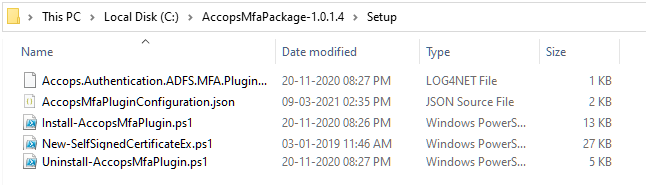

**2:** Install HyID PFX certificate on ADFS Server.
:::note

Steps to Create HyID PFX certificate using Accops Gateway.
```jsx title=" Change the Working Directoty to "/home/fes/fescommon/certs/"

[root@sso ~]# cd /home/fes/fescommon/certs/

[root@sso ~]# openssl x509 -inform PEM -in "sslcert.cer" -out HyID.crt

[root@sso ~]# openssl rsa -in "sslcert.pem" -out HyID.key

[root@sso ~]# openssl pkcs12 -inkey HyID.key -in HyID.crt -export -out HyID.pfx
			  Enter Export Password: xxxxxxxxx
			  Verifying - Enter Export Password: xxxxxxxx

```

If Wildcard SSL Certificate is being used on both Accops HySecure Gateway and AD FS Server then Please skip above step.

:::

**3:** Open MMC and export the HyID certificate as "Base-64 encoded X.509(.CER) and save in "C:\AccopsMfaPackage-1.0.1.4\Setup" directory of ADFS Server as "sslcert.cer"

* *sslcert.cer* is required to install the Accops MFA Plugin.

:::tip

*sslcert.cer* can be also exported as *Base-64 encoded X.509(.CER)* from accops gateway using below command.

[root@sso ~]# cd /home/fes/fescommon/certs/

[root@sso ~]# openssl x509 -inform PEM -in "sslcert.cer" -out sslcert.cer

:::


**4:** Update configuration file "C:\AccopsMfaPackage-1.0.1.4\Setup\AccopsMfaPluginConfiguration.json" as per requirement.

:::note

SecondFactorEndpoint 	: Accops HyID Server Endpoint

ServiceProvider 		: AD FS Server Endpoint

IdentityProvider 		: Accops Hysecure Gateway

```jsx title="AccopsMfaPluginConfiguration.json"
{
  "Settings": {
    "SecondFactorEndpoint": "https://sso.accops.cloud/saml-sfo/adfs", //Please replace "sso.accops.cloud" with HYID Server Address.
    "MinimalLoa": "http://accops.com/assurance/sfo-level2", //No Change Required
    "schacHomeOrganization": "accops.cloud", //Replace with "Forest Name"
    "ActiveDirectoryName": "accops.cloud", //Replace with Active Directory Name"
    "ActiveDirectoryUserIdAttribute": "sAMAccountName" //No Change Required
  },
  "ServiceProvider": {
    "SigningCertificate": "", //No Change
    "EntityId": "https://adfs.accops.in" //Enter ADFS Server Address"
  },
  "IdentityProvider": {
    "EntityId": "https://sso.accops.cloud", //Enter Accops HYID Server Address
    "Certificate": "sslcert.cer" //Accops Gateway SSL Certificate. Please Import Accops Gateway SSL Certificate in ADFS Server"
  }
}

```
:::

```jsx title="Sample value with required details in AccopsMfaPluginConfiguration.json"
{
    "Settings":  {
                     "SecondFactorEndpoint":  "https://sso.accops.cloud/saml-sfo/adfs",
                     "MinimalLoa":  "http://accops.com/assurance/sfo-level2",
                     "schacHomeOrganization":  "accops.cloud",
                     "ActiveDirectoryName":  "accops.cloud",
                     "ActiveDirectoryUserIdAttribute":  "sAMAccountName"
                 },
    "ServiceProvider":  {
                            "SigningCertificate":  "",
                            "EntityId":  "https://dadfs.accops.cloud"
                        },
    "IdentityProvider":  {
                             "EntityId":  "https://sso.accops.cloud",
                             "Certificate":  "sslcert.cer"
                         }
}
```

**5:** Launch Windows Powershell with Admin rights on ADFS Server and change the directory to "C:\AccopsMfaPackage-1.0.1.4\Setup".
```jsx title="Go to Setup Directory and Run ExecutionPolicy"
Windows PowerShell
Copyright (C) Microsoft Corporation. All rights reserved.

Try the new cross-platform PowerShell https://aka.ms/pscore6

PS C:\Windows\system32> cd C:\AccopsMfaPackage-1.0.1.4\Setup
PS C:\AccopsMfaPackage-1.0.1.4\Setup>
PS C:\AccopsMfaPackage-1.0.1.4\Setup> Set-ExecutionPolicy Unrestricted

Execution Policy Change
The execution policy helps protect you from scripts that you do not trust. Changing the execution policy might expose you to the security risks described in the about_Execution_Policies help
topic at https:/go.microsoft.com/fwlink/?LinkID=135170. Do you want to change the execution policy?
[Y] Yes  [A] Yes to All  [N] No  [L] No to All  [S] Suspend  [?] Help (default is "N"): A
PS C:\AccopsMfaPackage-1.0.1.4\Setup>
```
**6:** To Install Accops MFA Plugin Please Run ".\Install-AccopsMfaPlugin.ps1" in windows powershell on Adfs Server
```jsx title="Run Install-AccopsMfaPlugin.ps1"
PS C:\AccopsMfaPackage-1.0.1.4\Setup> .\Install-AccopsMfaPlugin.ps1
```
**7:** Once Installation is completed, Please keep the sigining certificate and password for Installaing the plugin on all AD FS farm servers.


## Configuration

#### Configurations Steps on ADFS Server to Enable Accops AD FS Plugin.

For AD FS 2012 R2: 

> Launch the AD FS Management console on your primary AD FS internal server. Navigate to AD FS → Authentication Policies and click the Edit Global Multi-factor Authentication... action, or click on the Edit link under Multi-factor Authentication → Global Settings.

For AD FS 206/2019: 

> Launch the AD FS Management console on your primary AD FS server and navigate to AD FS >> Service >> Authentication Methods.

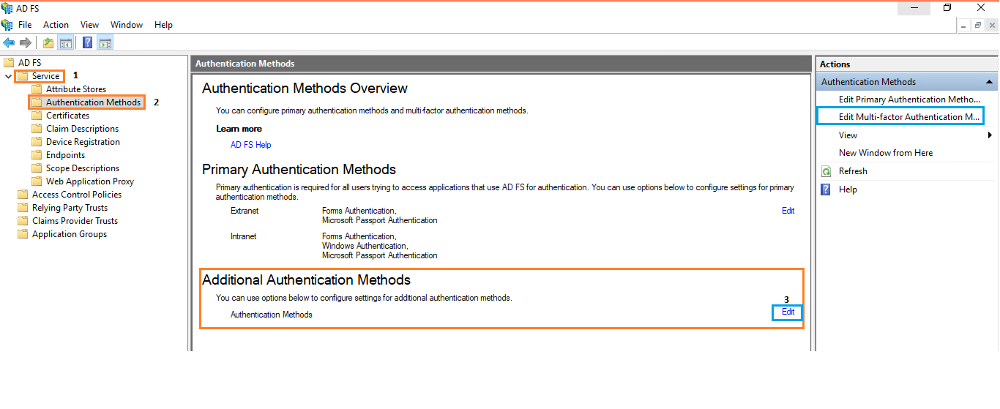

**2:** Click the Edit link under Multi-factor Authentication Methods or click Edit Multi-factor Authentication Methods... action on the far right.


**3:** Check the box next to the Accops MFA for AD FS authentication method to enable Accops MFA Plugin and then APply and Press OK

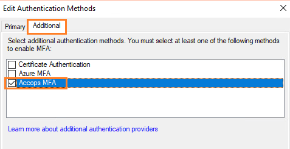

**4:** Open AD FS >> Relying Party Trusts , right-click the relying party trust, then select Edit Access Control Policy.

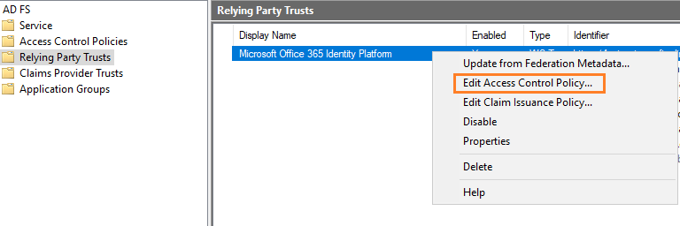

**5:** Pick a policy for the relying party that includes MFA and then click OK. The MFA policy immediately applies to the selected relying party.

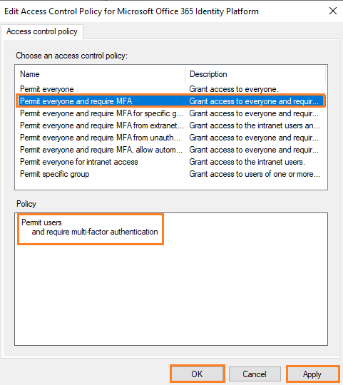

Above configuration will allow Office 365 Login with AD FS authentication followed by multi-factor authentication before accessing the application.

In an advanced multi-factor scenario, you can choose Intranet and/or Extranet location requirements, along with other conditions for access. Refer to the Microsoft article Access Control Policies in Windows Server 2016 AD FS for more information.

If you need to enforce more complex MFA rules for an Office 365 relying party, please take a look at our Guide to advanced client configuration for Accops with AD FS 3 and later with Office 365 Modern Authentication.

#### Configuration Steps on Accops HySecure Gateway to Allow Access of Relying Party.

**1:** Login with a digital certificate in Accops HySecure Gateway using Security Officer Account.

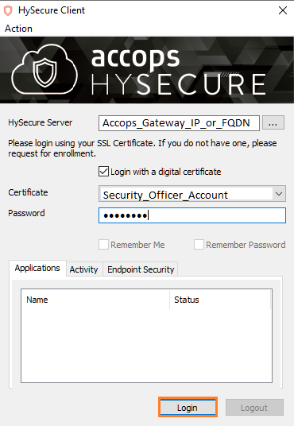

**2:** Create a HTTPS Application as below with SAML configuration.

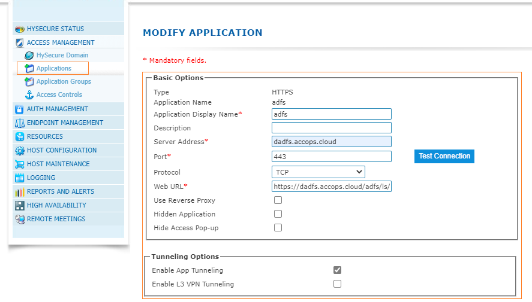
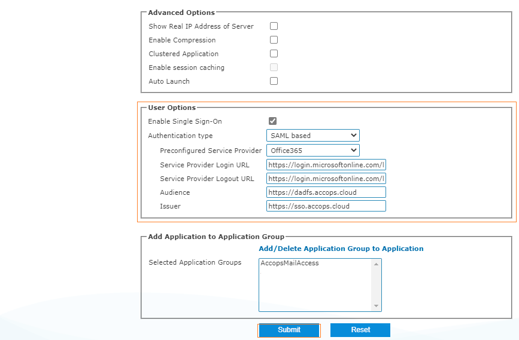

**3:** Create Access Control Policy.

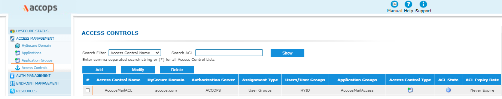
## Logs
1: All logs for Accops MFA Plugin will be logged in Windows Event Viewer.

Start >>Event Viewer >> APplications and Services Logs >> Accops MFA Plugin.

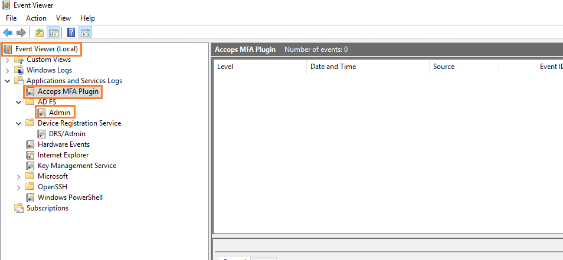

## Sign In using Accops MFA

After enabling the MFA to Relying party apps MFA can be tested by Accessing Service Provider URL.

Login Flow for  Service Provider will be  Web Application >> ADFS authentication >> MFA PAge Verification >> Redirect to Application post successful authentication.

**1:** Please go to https://office.com and select "Sign In" to Test your Setup.

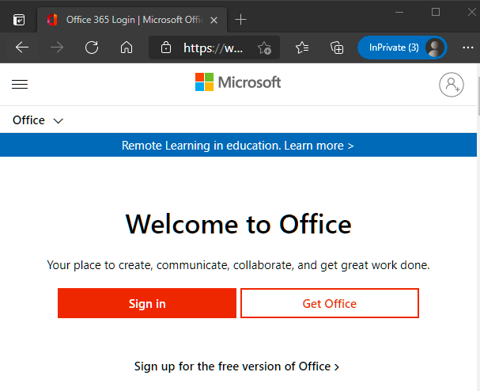

**2:** Enter your e-mail address and click on Next... it will redirect to AD FS server for Primary Authentication.

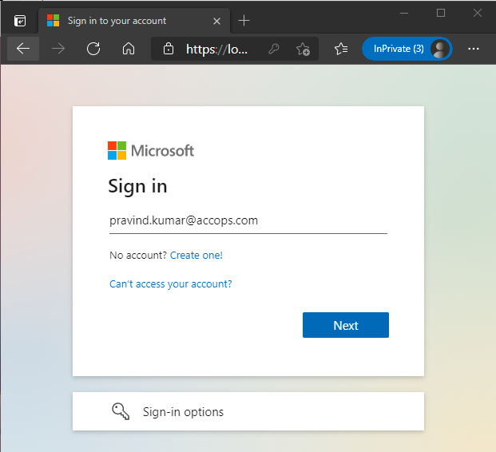

**3:** Enter Domain Credentials and select "Sign In" for Primary Authentication.

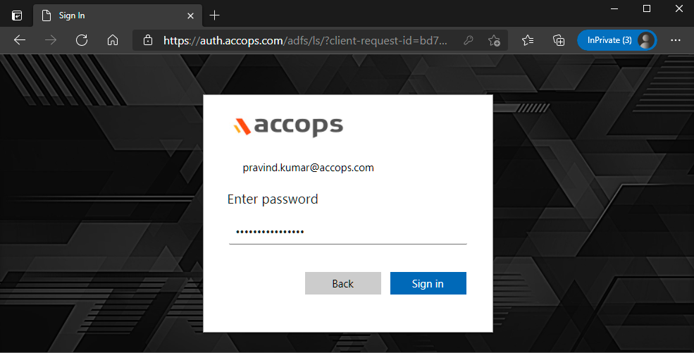

**4:** On below screen Multi-Factor Authentication will be shown to End-User as per configured Token Type.

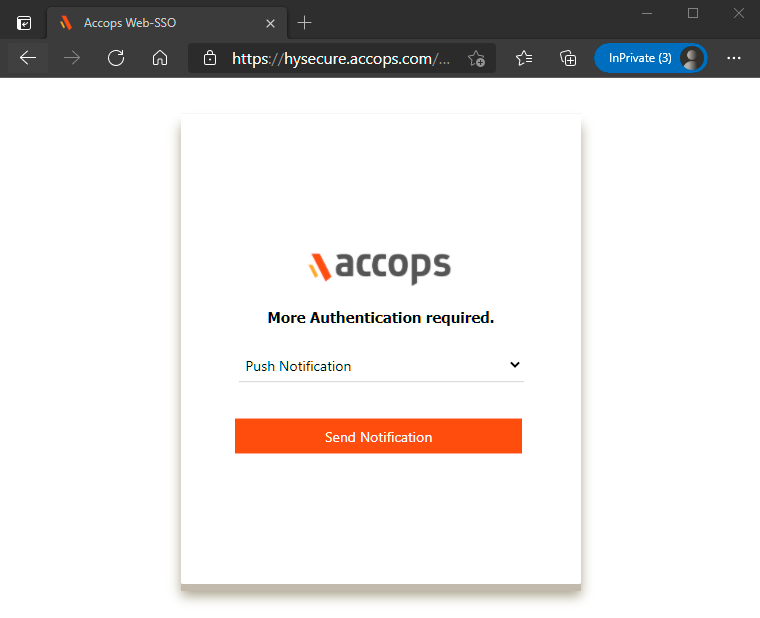

**5:** Push notification POP up will be displayed on End-User Device as per below screen to either "Authorize" or "Reject".

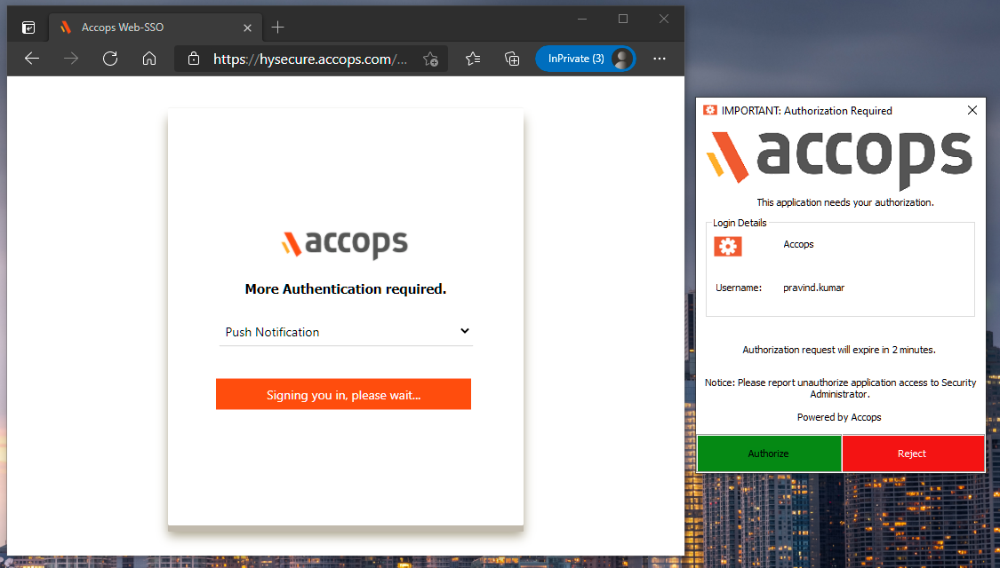

** 6: ** After Successful Authorization Office 365 can be access by End-User Device.

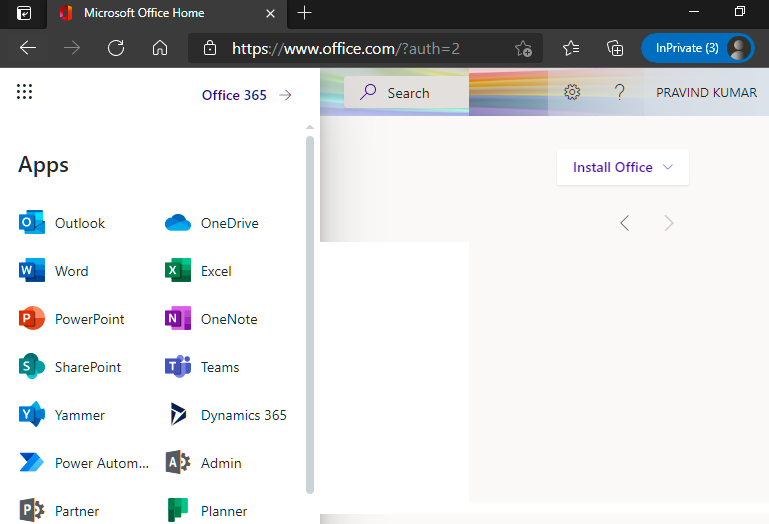

## Help/Support

Please send a mail to *support@accops.com* for further help/Support.